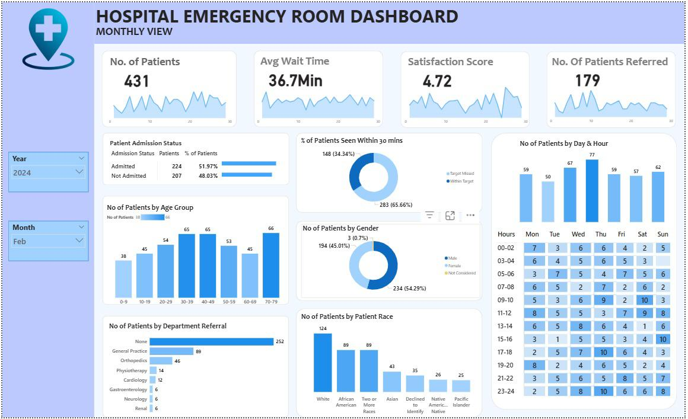

# 🏥 Hospital Emergency Room Analysis Dashboard

A modern, interactive, and professional **Power BI dashboard** designed to analyze and optimize **Emergency Room (ER) performance**.  
This project transforms raw hospital data into actionable insights, enabling healthcare stakeholders to track patient management, operational efficiency, and service quality in real time.

---

## ✨ Features

- 📊 **Comprehensive ER Metrics**
  - Total patients, daily admissions, referrals, wait times, and satisfaction scores.  
- ⏱️ **Operational Efficiency Tracking**
  - Average patient wait times, timeliness analysis (patients seen within 30 mins).  
- 👩‍⚕️ **Demographic Analysis**
  - Age distribution, gender analysis, and racial demographics for equitable care insights.  
- 🩺 **Department Referrals**
  - Identify high-demand specialties (e.g., Orthopedics, Cardiology, Pediatrics).  
- ✅ **Admission Status**
  - Admitted vs. non-admitted patients tracked over time.  
- 🎨 **Stunning Visuals**
  - Elegant neon-inspired design with sparklines, cards, grids, and dynamic slicers.  
- 🔄 **Multiple Dashboards**
  - **Monthly View** — Track key metrics and trends month-by-month.  
  - **Consolidated View** — High-level summary over any date range.  
  - **Patient Details** — Granular patient-level insights.  
  - **Final Consolidation** — Summarized findings, anomalies, and recommendations.  

---

## 🛠️ Tech Stack

- **Power BI** — Interactive dashboard design and analytics  
- **DAX (Data Analysis Expressions)** — Custom calculations and measures  
- **Power Query** — Data cleaning, transformation, and modeling  
- **Healthcare Dataset** — Patient demographics, referrals, satisfaction scores, wait times  

---

## 🚀 Project Workflow

1. **Requirement Gathering** — Identify business needs and KPIs  
2. **Data Walkthrough** — Understand fields like patient ID, age, gender, race, referrals, etc.  
3. **Data Connection** — Connect raw hospital/emergency datasets  
4. **Data Cleaning** — Quality check, remove duplicates, anonymize sensitive info  
5. **Data Modeling** — Establish relationships between entities (patients, departments, admissions)  
6. **DAX Calculations** — Create custom measures (wait time averages, referral counts, satisfaction trends)  
7. **Dashboard Layout** — Wireframe design with focus on readability & usability  
8. **Visualization** — Charts, sparklines, cards, maps, grids, slicers  
9. **Insights Generation** — Identify patterns, anomalies, and actionable recommendations  

---

## 📷 Dashboard Preview

## 📌 Use Cases

- Hospital administrators tracking ER efficiency
- Resource allocation for high-demand departments
- Patient experience monitoring (satisfaction & wait times)
- Healthcare researchers studying demographic trends in ER visits
- Quality improvement teams identifying bottlenecks

## 🤝 Contribution

- Contributions are welcome!
- Suggestions for new metrics, visuals, or optimizations can be submitted via pull requests.

## 📜 License

This project is licensed under the MIT License.

## 🙌 Acknowledgements

- Microsoft Power BI for advanced visualization and analytics
- All healthcare professionals working to improve emergency services
